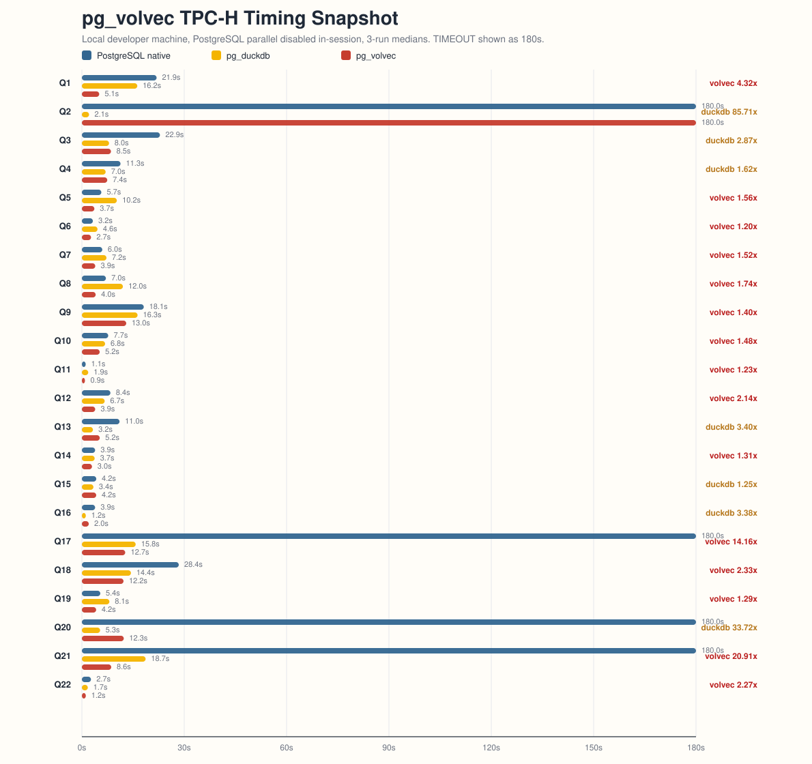

# pg_volvec

`pg_volvec` is a PostgreSQL extension prototype that keeps PostgreSQL planning unchanged and offloads supported OLAP plan subtrees into a vectorized executor.

## Architecture

- PostgreSQL still plans the query. `pg_volvec` hooks `ExecutorStart` / `ExecutorRun` / `ExecutorEnd` and intercepts only supported subtrees.
- The execution engine is columnar and `DataChunk`-oriented. The main operator family today is `SeqScan -> optional qual -> HashJoin / Agg / Sort / Limit / SubqueryScan`.
- Scan hot paths use tuple deform JIT to decode heap tuples directly into typed column arrays.
- Expression evaluation lowers to a linear IR and, when supported, compiles to fused LLVM loops so intermediate vector temporaries do not need to be materialized.
- TPC-H-style `NUMERIC(15,2)` values run as scaled `int64` in the hot path, with widened accumulation for aggregation.
- Wider exact numeric expressions use an `int128`-style `Wide128` path for correctness. That path is currently interpreter-only; expression JIT intentionally fences it off until the LLVM lowering supports the same wide semantics.
- Strings use prefix-aware refs and only fall back to owned storage when needed.

In short: PostgreSQL planner on top, `pg_volvec` columnar executor underneath, with JIT on both tuple deform and expression evaluation.

## Current Coverage

Fully verified offloaded TPC-H queries:

- Q1
- Q3
- Q4
- Q5
- Q6
- Q7
- Q8
- Q9
- Q10
- Q11
- Q12
- Q13
- Q14
- Q15
- Q16
- Q18
- Q19
- Q20
- Q22

Offloaded with narrower validation:

- Q2
- Q17
- Q21

`Q17` now runs through the process-parallel path on the live TPC-H data set and matches the rewrite-based native reference; the remaining gap is a full original-query native diff, because the local native PostgreSQL plan times out at the 180s benchmark cap.

`Q21` is intentionally deprioritized for now. The dominant problem on that query shape looks more like PostgreSQL planner quality on many-table joins plus sublinks than a clear missing primitive inside the `pg_volvec` executor.

## TPC-H Timing Snapshot

The chart below compares PostgreSQL, `pg_duckdb`, and `pg_volvec` on all 22 TPC-H queries using a single fair benchmark sweep on the developer machine.

- All three engines come from the `2026-04-09` full-suite rerun.
- Each point is the median of 3 runs.
- PostgreSQL parallel query is disabled in-session for all three engines.
- `TIMEOUT` is plotted as `180s`.

Quick read:

- Across the 18 direct `OK vs OK vs OK` comparisons, `pg_volvec` is fastest on 13 and `pg_duckdb` is fastest on 5.
- The geometric mean speedup versus native PostgreSQL on those direct comparisons is about `1.72x` for `pg_volvec` and `1.22x` for `pg_duckdb`.
- Native PostgreSQL hits the `180s` cap on `Q2`, `Q17`, `Q20`, and `Q21`; `pg_volvec` still times out on `Q2`; `pg_duckdb` completes all 22 in this sweep.



The underlying snapshot is checked into [tpch_perf_snapshot.tsv](tpch_perf_snapshot.tsv).

### Process-Parallel Checkpoint

The 2026-04-12 process-parallel sweep skips Q2 and Q21, keeps PostgreSQL `Gather` parallelism off, and uses median-of-3 timings. `pg_duckdb` and native PostgreSQL keep `max_parallel_workers = 0`; `pg_volvec` uses `pg_volvec.parallel = on`, `pg_volvec.parallel_max_workers = 4`, and `max_parallel_workers = 8`. Q3 uses `enable_eager_aggregate = off` for all three engines so the plan shape stays compatible with the current `pg_volvec` lowering.

Quick read:

- Across the 18 direct `OK vs OK vs OK` comparisons, `pg_volvec` is fastest on 11, `pg_duckdb` is fastest on 6, and native PostgreSQL is fastest on 1.
- The geometric mean speedup versus native PostgreSQL on those direct comparisons is about `1.55x` for `pg_volvec` and `1.10x` for `pg_duckdb`.
- Q17 is now process-parallel and correct in this sweep: native PostgreSQL times out at `180s`, `pg_duckdb` is `15.364s`, and `pg_volvec` is `14.601s`.
- This sweep predates the 2026-04-13 process-parallel bad-shape guard. In the raw sweep, Q10, Q12, and Q14 regressed versus native PostgreSQL; a follow-up spot fix now skips Q10/Q14 shapes where a small `HashProbeSource` would make workers redundantly build a much larger local hash-join subtree. Q12 did not reproduce as a bad process-parallel choice in the post-fix spot check, but the chart should be refreshed with a full rerun.
- Q20 finishes in `pg_volvec` but is still much slower than `pg_duckdb`.

The process-parallel checkpoint data is checked into [tpch_perf_process_parallel_skip_q2_q21_20260412.tsv](tpch_perf_process_parallel_skip_q2_q21_20260412.tsv).

## Build And Install

Use PostgreSQL's top-level Meson build.

```bash
meson setup build \
  --prefix="$(pwd)/installed" \
  -Dllvm=enabled \
  --buildtype=debugoptimized

meson compile -C build pg_volvec
meson install -C build --only-changed
```

## Project Layout

- `src/bridge/`: PostgreSQL hook integration and result handoff
- `src/engine/executor.cpp`: vectorized plan initialization and operator implementations
- `src/engine/expr.cpp`: expression lowering and interpreter
- `src/engine/llvmjit_expr.cpp`: expression JIT
- `src/engine/llvmjit_deform_datachunk.cpp`: tuple deform JIT

## More Docs

- [LOCAL_RUNBOOK.md](LOCAL_RUNBOOK.md): local build, install, startup, profiling, and benchmark workflow
- [DESIGN.md](DESIGN.md): higher-level executor design
- [llvmjit_expr.md](llvmjit_expr.md): expression JIT notes
- [jit_deform_datachunk.md](jit_deform_datachunk.md): deform JIT notes
- [vecSortDesign.md](vecSortDesign.md): current sort design
- [page-wise-scan.md](page-wise-scan.md): page-wise scan notes
- [ROADMAP.md](ROADMAP.md): longer-term direction
- [TODO.md](TODO.md): near-term work items

## License

PostgreSQL License.
