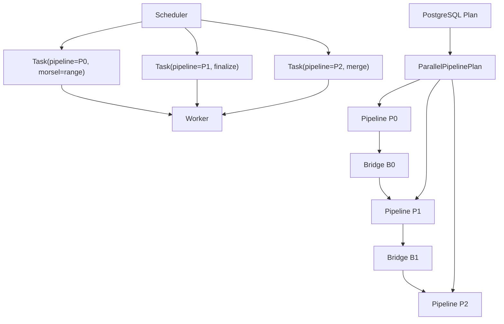

# Morsel-Driven Parallel Execution Design

Status: partially implemented, refreshed on `2026-04-17`

This document describes the next parallel execution direction for `pg_volvec`.
It replaces the older scan-only "parallel deformer workers" idea with a
pipeline DAG plus morsel scheduler model that is closer to modern vectorized
SQL engines.

The goal is not to build a new optimizer. PostgreSQL still owns planning.
`pg_volvec` continues to hook at executor time and lowers accepted PostgreSQL
plans into a parallel runtime when the shape is supported.

## Goal

Introduce process-based morsel-driven parallel execution inside `pg_volvec`
without requiring PostgreSQL planner changes.

The design should:

- schedule work as `pipeline x morsel` tasks
- make pipeline breakers explicit
- support dependency-aware execution across pipelines
- let workers run local vector kernels and publish partial state
- avoid sharing process-local `DataChunk` objects directly

## Non-Goals For The First Iteration

- planner rewrites or optimizer decorrelation
- thread-based execution inside a backend
- sharing live `DataChunk *` pointers across processes
- full SQL coverage
- true parallel outer/semi/anti join support
- external sort spill
- sharing leader-side LLVM JIT function pointers with workers

## Current Boundaries

- `Wide128`/int128 exact numeric expression programs are interpreter-only.
  Worker and leader expression JIT only cover the safer `int64`-width numeric
  subset today.
- Process workers currently disable local expr/deform JIT during plan
  initialization. This is a correctness and lifecycle fence while the
  process-local pipeline runtime is still being split out from full
  `VecPlanState` rebuilding.
- Q3's default PostgreSQL plan may use eager partial/final aggregate nodes.
  That shape is deliberately outside the current offload set; use
  `enable_eager_aggregate=off` when validating the current Q3 process-parallel
  pipeline.
- Q12 is correct in the process-worker path, but the current worker model still
  rebuilds a local hash-join state per worker. Until the hash-build bridge is
  fully shared, `parallel_leader_participation=off` is a better validation mode
  because the leader otherwise can consume the shared source scan before
  workers finish their local build phase.

## Why Replace The Older Parallel Deformer Idea

The old design over-focused on scan/deform and assumed that workers could push
shared `DataChunk` objects to the leader.

That no longer fits the current engine:

- `DataChunk` is allocated in PostgreSQL `MemoryContext` and owns a local
  `string_arena`
- current hot queries are not dominated purely by deform anymore
- the current engine already has multiple blocking operators whose dependency
  structure matters more than deform alone

The new design treats scan/deform as one piece of pipeline work, not the whole
parallel architecture.

## Concept Model

The execution model should be read as a stack of objects, not as one giant
"scheduler" concept:

1. `Plan`
   PostgreSQL's already-chosen physical plan tree.
2. `PipelinePlan`
   `pg_volvec`'s lowered parallel execution plan. This is the static DAG for
   the lifetime of one query.
3. `Pipeline`
   One node in that DAG. A pipeline describes one executable dataflow region
   between breakers.
4. `Bridge`
   The dependency handoff object between pipelines.
5. `Task`
   One schedulable unit of work for a specific pipeline, usually a
   `pipeline x morsel` instance.
6. `Scheduler`
   The shared runtime that decides which task is ready next.
7. `Worker`
   A process that repeatedly dequeues ready tasks and executes them locally.

This is closer to DuckDB's:

- `MetaPipeline -> Pipeline -> Event -> Task`

than to PostgreSQL's traditional pull-based executor tree.

## Terminology

### PipelinePlan

A `PipelinePlan` is the static parallel lowering result for one accepted
PostgreSQL plan tree.

It owns:

- all `Pipeline` descriptors
- the dependency DAG between pipelines
- the bridge kinds between producer and consumer pipelines
- the root pipeline id

In DuckDB terms, this object plays part of the role of:

- `MetaPipeline`
- the executor-owned event/dependency graph

but is intentionally simpler for the first `pg_volvec` version.

### Pipeline

A `Pipeline` is a connected region of the physical plan without a blocking
operator in the middle. It is a plan object, not a runtime task.

Example:

`SeqScan -> Filter -> Project -> PartialAgg`

is one pipeline.

A pipeline owns the following concepts:

- the driver kind
  - source-driven scan
  - bridge-finalize pipeline
- its stage mask
  - partial agg
  - hash build
  - hash probe
  - sort run
- its input bridge kind
- its output bridge kind
- its predecessor pipeline ids
- its successor pipeline ids
- its source relation identity, if it is a source pipeline

The important point is:

**worker does not receive a free-floating morsel.**

Worker receives a `Task`, and that `Task` always names the pipeline that owns
the work.

### Source Pipeline

A source pipeline is a pipeline whose driver pulls from a relation source.

Examples:

- `SeqScan -> Filter -> Project -> PartialAgg`
- `lineitem scan -> filter -> HashProbe -> PartialAgg`

Source pipelines are the only pipelines that naturally consume block-range
morsels in the first design.

### Finalize Pipeline

A finalize pipeline does not scan relation pages directly. It consumes an
upstream bridge.

Examples:

- aggregate merge/finalize
- hash build finalize
- sort merge/finalize

This is similar to DuckDB's use of pipeline events that are only released once
dependencies are complete.

### Pipeline Breaker

A breaker is an operator that must accumulate or finalize state before a
downstream pipeline can safely proceed.

Current examples in `pg_volvec`:

- `HashJoin` build side
- `Agg`
- `Sort`

### Morsel

A morsel is the unit of schedulable input work for a pipeline.

For a source pipeline this is usually a block range, for example:

- relation `lineitem`
- blocks `[4096, 4224)`

For later in-memory stages it can be:

- a partition range
- a chunk range
- a run range

A morsel is **not** a `DataChunk`.

- `morsel` answers: "which portion of input/work does this task own?"
- `DataChunk` answers: "what vector batch is flowing locally inside one
  process while that task runs?"

One source morsel will usually produce many local `DataChunk` batches.

### Task

A task is a runtime execution instance of one pipeline.

Formally:

`Task = { pipeline_id, task_kind, morsel payload }`

Typical kinds:

- source scan morsel
- partial aggregate morsel
- hash build morsel
- hash probe morsel
- local sort morsel
- final merge task

Examples:

- `{pipeline=P0, kind=SourceMorsel, start_block=4096, nblocks=128}`
- `{pipeline=P1, kind=BridgeFinalize}`

The key distinction is:

- `Pipeline` is part of the plan
- `Task` is one scheduled execution of that pipeline

So yes, the pipeline absolutely belongs to the task model. The scheduler does
not hand out anonymous morsels.

### Bridge

A bridge is shared state that connects a producer pipeline to a dependent
consumer pipeline.

Examples:

- hash table bridge
- aggregate finalize bridge
- sort run bridge

In DuckDB terms this is closest to the shared handoff state hidden behind:

- join build synchronization
- pipeline finish events
- sink/finalize boundaries

For `pg_volvec`, bridge should be explicit in the design because we are
building on top of PostgreSQL executor hooks rather than reusing a native
pipeline runtime.

### Scheduler

The scheduler is the shared runtime object that owns:

- pipeline runtime state
- ready task queue
- dependency counters
- bridge readiness
- completion / error / cancellation state

It does **not** own query semantics. Query semantics live in the lowered
pipeline plan and in the local kernels used by workers.

### Worker

A worker is a PostgreSQL parallel worker process attached to the shared
scheduler state.

The worker lifecycle is:

1. attach DSM
2. reconstruct local runtime context
3. loop:
   - dequeue ready task
   - execute local kernel for the task's pipeline
   - publish bridge/runtime updates
4. exit when query is complete or cancelled

This is closer to Velox/modern engines than to PostgreSQL's native node-at-a-
time executor.

## Object Relationships



Read this diagram left to right:

- `Plan` is lowered into a static `ParallelPipelinePlan`
- that plan contains `Pipeline` nodes and bridge/dependency metadata
- the `Scheduler` emits runtime `Task`s
- every task explicitly references its owning pipeline
- worker executes the task using local process memory

## Relation To DuckDB

The closest mapping is:

- PostgreSQL `Plan`
  -> DuckDB physical operator tree
- `pg_volvec::ParallelPipelinePlan`
  -> DuckDB `MetaPipeline` graph plus its dependency bookkeeping
- `pg_volvec::ParallelPipelineDesc`
  -> DuckDB `Pipeline`
- `pg_volvec::ParallelBridgeState`
  -> DuckDB sink/build/finalize handoff state
- `pg_volvec::ParallelTaskDesc`
  -> DuckDB `PipelineTask` or event-scheduled executor task
- `pg_volvec::ParallelSchedulerState`
  -> DuckDB `TaskScheduler` plus executor-owned ready state

There are also important differences:

- DuckDB is thread-based in one process; `pg_volvec` will be process-based
  because it runs inside PostgreSQL
- DuckDB owns the optimizer and physical pipeline builder; `pg_volvec`
  receives a PostgreSQL plan and lowers it afterward
- DuckDB can share in-process objects directly; `pg_volvec` must separate
  local execution objects from DSM-visible bridge state

## Lowering Layers

To avoid losing the notion of pipeline during scheduling, lowering should be
thought of as three explicit layers:

1. `Plan -> PipelinePlan`
   Static segmentation and dependency extraction.
2. `PipelinePlan -> SchedulerState`
   Runtime counters, ready queues, bridge state, source progress.
3. `SchedulerState -> Task`
   A specific runnable unit, always tied to one pipeline.

The scheduler never invents new pipeline semantics. It only instantiates work
for pipelines already described by `PipelinePlan`.

## Current Operator Classification

### Non-breakers in the first design

These stay inside one pipeline:

- `SeqScan`
- `Filter`
- `Project`
- expression evaluation
- light probe-side residual filtering

### Breakers in the first design

- `Agg`
  - source pipeline produces partial aggregate state
  - finalize pipeline merges and emits final groups
- `HashJoin`
  - build source pipeline produces worker-local build fragments
  - build finalize pipeline merges fragments into a read-only hash bridge
  - probe pipeline starts only after build finalize completes
- `Sort`
  - local sort pipeline produces sorted runs
  - merge pipeline merges runs and emits output

### Deferred for later

- `Material`
- rescan-heavy subplans
- broad `NestLoop`
- true `MergeJoin`
- generic outer/semi/anti parallel semantics

## High-Level Runtime Model

### 1. PostgreSQL plan is lowered into a pipeline DAG

`pg_volvec` already accepts a PostgreSQL `Plan` tree and lowers it into
`VecPlanState`.

The parallel path adds an intermediate lowering:

`Plan -> Pipeline DAG -> Tasks -> Worker Runtime`

This lowering is executor-only. PostgreSQL planning remains unchanged.

### 2. Dependencies are explicit

Each pipeline tracks:

- its predecessor count
- its output bridge
- whether it is ready to schedule

Example for `HashJoin`:

- `P0 = hash build source`
- `P1 = hash build finalize`
- `P2 = hash probe`
- `P1` waits for `P0`
- `P2` waits for `P1`

Example for grouped aggregate followed by sort:

- `P0 = partial grouped agg`
- `P1 = final merge agg`
- `P2 = sort/emit`

Dependencies:

- `P1` waits for `P0`
- `P2` waits for `P1`

### 3. Scheduler owns all runnable tasks

The scheduler:

- keeps a ready queue of runnable tasks
- hands tasks to workers
- tracks pipeline completion
- publishes downstream readiness when dependency counters reach zero

Workers do not choose arbitrary next work. They execute tasks assigned by the
global scheduler, and each task already identifies the pipeline whose kernel
must be invoked.

## Scheduler State vs Pipeline Plan

This distinction is important enough to state explicitly.

### Static plan-time objects

These do not change during execution:

- `ParallelPipelinePlan`
- `ParallelPipelineDesc`
- dependency edges
- bridge kinds

### Runtime objects

These change continuously:

- `ParallelPipelineRuntimeState`
- `ParallelBridgeState`
- ready task queue
- worker-local progress
- completion / cancellation flags

The current prototype already has this split in code:

- `ParallelPipelinePlan`
- `ParallelSchedulerState`

That split should remain. It is the right direction.

## Process Model

Use PostgreSQL's built-in `ParallelContext` infrastructure rather than manual
dynamic background worker setup.

Reasons:

- worker lifecycle is already handled
- active snapshot is propagated by PostgreSQL
- DSM and worker attachment are already integrated with backend cleanup

This matches PostgreSQL's process model better than a custom side system.

## Worker Task Loop

The first worker loop should be conceptually simple:

```text
while (!query_done) {
  task = scheduler.dequeue_ready_task();
  if (!task) {
    wait for latch / wakeup;
    continue;
  }
  execute_task(task);
  scheduler.finish_task(task);
}
```

The important point is that `execute_task(task)` dispatches by
`task.pipeline_id` and `task.task_kind`, not by guessing from the morsel
payload.

For a source task:

- locate the owning source pipeline
- build local scan/filter/project/partial-agg kernel state
- scan the task's block-range morsel
- publish local partial bridge state

For a finalize task:

- locate the owning finalize pipeline
- consume the named input bridge
- merge/finalize results

## Local Execution Kernel

Inside one worker, execution is still vectorized and chunk-based:

- one task enters a pipeline-local kernel
- that kernel repeatedly produces local `DataChunk`s
- operators in that pipeline consume those chunks
- only bridge state is published across processes

So the layering is:

- scheduler level: pipeline + morsel
- kernel level: repeated `DataChunk` processing

## Shared State Layout

The DSM segment should contain:

- scheduler header
- pipeline descriptors
- bridge descriptors
- per-worker status
- task queues or queue metadata
- fixed-size partial result slots
- optional serialized bridge state metadata

The DSM segment should not contain live `DataChunk *` objects.

## Local Chunk vs Shared Bridge Memory Model

`pg_volvec` currently uses `DataChunk` as a process-local execution buffer.
That is still the right choice for local vector kernels, but it cannot be the
cross-process transport format.

### Why `DataChunk` cannot be shared directly

The current `DataChunk` implementation is tightly bound to PostgreSQL
`MemoryContext` and local process ownership:

- the object itself is allocated with `MemoryContextAllocAligned`
- `string_arena` is a local allocator-backed vector
- `VecStringRef.offset` points into that local arena

Therefore a leader cannot safely read a `DataChunk *` created by a worker, and
a worker cannot hand off arena-backed string references to another process.

### Rule

- inside one process:
  use normal `DataChunk`
- across processes:
  do not pass `DataChunk *`

### What crosses process boundaries in the first design

Only shared bridge state should cross process boundaries:

- scheduler metadata
- task descriptors
- worker status
- partial aggregate state
- hash build fragments or finalized hash bridge metadata
- sort run metadata

This means the first parallel version is bridge-driven, not chunk-stream-driven.

## Current Prototype Status

As of 2026-04-09, the executor prototype has these pieces running locally:

- `Plan -> ParallelPipelinePlan` lowering
- `ParallelSchedulerState` construction with explicit dependencies and bridges
- source morsel task materialization with real `{start_block, nblocks}` ranges
- block-range scanning in `VecSeqScanState`
- a leader-only source task loop for aggregate source pipelines
- a first process-worker path for single-source partial aggregates
- source scan attachment to PostgreSQL native `ParallelTableScanDesc` and
  parallel heap `read_stream`

The leader-only path is intentionally narrow, but it is no longer a dry-run:

- `Q6` now executes real `SourceMorsel` tasks and then finalizes the aggregate
- `Q1` also reuses the same source-morsel aggregate path, then hands off to the
  existing serial downstream `Sort`

The current split is intentionally hybrid:

- the generic scheduler still models source work as `SourceMorsel` tasks
- the process-worker path does **not** yet use the shared scheduler for source
  page allocation
- instead, once a process enters the source pipeline, PostgreSQL native
  parallel heap scan owns page/block allocation through
  `table_beginscan_parallel(...)`

What is still missing:

- worker launch and DSM-backed shared scheduler state
- cross-process bridges
- parallel hash build/probe
- parallel sort run generation and merge

### Consequence for source pipelines

A worker running a source pipeline may internally create and consume many
`DataChunk` batches while processing one morsel, but those chunks remain local
to that worker.

Example:

- task: `pipeline=0, start_block=4096, nblocks=128`
- worker scans the block range
- worker repeatedly fills local `DataChunk` batches
- filter/project/partial-agg consume those batches locally
- only the resulting partial bridge state is published

### If we later need cross-process batch transfer

That should use a separate POD-style shared format, for example a serialized
`SharedChunk` with:

- fixed-size column payloads
- null bitmap / selection data
- a shared string slab
- offsets into the shared slab rather than local vector storage

That is a future extension. It should not be the baseline design for the first
morsel runtime.

## Task Scheduling

### Source pipelines

The abstract design is still:

- `start_block = fetch_add(next_block, morsel_nblocks)`
- `end_block = min(start_block + morsel_nblocks, rel_nblocks)`

If `start_block >= rel_nblocks`, the source pipeline is locally exhausted for
that worker.

However, the current process-worker implementation already delegates this
lowest-level block allocation to PostgreSQL native parallel heap scan:

- leader initializes one shared `ParallelTableScanDesc`
- each worker opens the source relation with `table_beginscan_parallel(...)`
- heapam/read_stream then decide which block chunk each participant reads next

So the runtime direction is:

- `pg_volvec` scheduler owns pipeline/bridge/task dependencies
- PostgreSQL native parallel scan owns low-level source page assignment

### Non-source pipelines

For build/probe/finalize/merge stages, tasks are generated from upstream
bridge state.

Examples:

- aggregate merge task over a shard range
- hash probe task over a block morsel
- sort merge task over a run window

## Execution Strategy By Operator

### SeqScan / Filter / Project

Workers execute the vector scan kernel locally for one source task:

- open relation
- begin local scan state
- attach shared `ParallelTableScanDesc` when running the process-worker path
- let heapam/read_stream provide the next block chunk
- run deform JIT / expr JIT locally
- feed results to the current pipeline sink

This stage should not publish `DataChunk` objects cross-process in the first
design.

### Aggregate

#### Ungrouped aggregate

Each worker keeps a local accumulator:

- `sum`
- `count`
- `avg`
- `max`

When the worker finishes its assigned morsels, it publishes its local partial
state into DSM.

The finalize pipeline merges those partial states and produces one final batch.

#### Grouped aggregate

Each worker keeps a local hash table keyed by group columns.

At pipeline completion:

- local hash tables are published to a merge bridge
- finalize tasks merge them into a global aggregate table
- output emission happens only after the merge stage is complete

This keeps worker updates lock-free for the hot path.

### Hash Join

#### Build pipeline

Workers consume build-side morsels and create worker-local build partitions or
worker-local hash tables.

When build morsels are complete, a build-finalize step merges them into a
shared read-only hash bridge.

Current implementation note:

- simple source-driven hash build can export/merge worker-local hash fragments
- nested build pipelines that depend on an upstream hash bridge may still fall
  back to a leader-built shared hash bridge
- Q11 is the important example: the supplier/nation build feeds the partsupp
  probe, and worker initialization must be pipeline-specific rather than using
  the whole root plan or a blindly selected `HashJoin` subtree
- this fallback is correctness-preserving and has been smoke-tested, but it is
  not the final parallel build design

#### Probe pipeline

Probe tasks do not begin until the build bridge is marked ready.

Probe workers then:

- scan their probe-side morsels
- read from the shared hash bridge
- run residual join filter locally
- feed local downstream sink state

The first iteration should only target inner join.

### Sort

Workers create local sorted runs for their assigned morsels.

The sort bridge stores run metadata, not fully shared row-batch queues.

After all local runs are ready:

- a merge pipeline performs k-way merge
- the leader may own the final merge at first

This is enough for the current Q1-style final sort.

## Bridges

### Aggregate Bridge

Stores:

- worker completion count
- per-worker partial aggregate slots
- merge state readiness

### Hash Build Bridge

Stores:

- build-source completion count
- pointers or identifiers for worker-local build fragments
- build-finalize progress
- merged read-only hash table metadata
- ready flag for probe pipeline

### Sort Bridge

Stores:

- local run descriptors
- run count
- merge readiness

## First Supported Parallel Shapes

### Phase 1: Q6

Pipelines:

- `P0: SeqScan -> Filter/Project -> PartialAgg`
- `P1: FinalizeAgg -> Emit`

This is the minimum useful path and validates:

- source morsels
- partial aggregates
- finalize dependencies
- leader/worker integration

### Phase 2: Q1

Pipelines:

- `P0: SeqScan -> Filter -> PartialGroupedAgg`
- `P1: FinalGroupedAggMerge`
- `P2: Sort -> Emit`

This validates:

- grouped aggregate merge
- downstream breaker chaining
- local-sort plus final merge

### Phase 3: Q14

Pipelines:

- `P0: part scan -> filter -> HashBuildSource`
- `P1: HashBuildFinalize`
- `P2: lineitem scan -> filter -> HashProbe -> PartialAgg`
- `P3: FinalizeAgg -> Project -> Emit`

This validates:

- explicit build/finalize/probe dependency
- probe-side parallel scan
- aggregate after join

### Phase 4: Q19

Pipelines:

- `P0: part scan -> filter -> HashBuildSource`
- `P1: HashBuildFinalize`
- `P2: lineitem scan -> string-heavy filter -> HashProbe -> PartialAgg`
- `P3: FinalizeAgg -> Emit`

This is the first string-heavy stress case for the same model.

## What The First Implementation Should Avoid

- no cross-process `DataChunk` sharing
- no shared mutable global aggregate table in the hot worker path
- no attempt to parallelize every join family up front
- no planner rewrites
- no full outer-source pipeline in the initial runtime

## Recommended Internal API Sketch

```cpp
struct ParallelPipelinePlan;
struct ParallelPipelineDesc;
struct ParallelBridge;
struct ParallelTask;
struct ParallelSchedulerState;
struct ParallelWorkerContext;

class ParallelPipelineKernel {
public:
  virtual void execute_task(const ParallelTask &task,
                            ParallelSchedulerState &state) = 0;
};
```

Suggested concrete kernels:

- `ParallelScanAggKernel`
- `ParallelHashBuildSourceKernel`
- `ParallelHashBuildFinalizeKernel`
- `ParallelHashProbeKernel`
- `ParallelSortRunKernel`
- `ParallelFinalizeKernel`

And a dispatch layer like:

```cpp
class ParallelTaskDispatcher {
public:
  void execute_task(const ParallelTask &task,
                    ParallelWorkerContext &worker,
                    ParallelSchedulerState &scheduler);
};
```

The dispatcher first resolves the task's `pipeline_id`, then chooses the
correct kernel for that pipeline.

## Recommended Runtime API Shape

The runtime should eventually expose explicit layers matching the concepts
above:

```cpp
struct ParallelPipelineDesc {
  uint32_t pipeline_id;
  ParallelPipelineDriverKind driver_kind;
  ParallelPipelineRole role;
  ParallelBridgeKind input_bridge;
  ParallelBridgeKind output_bridge;
  uint32_t stage_mask;
};

struct ParallelTaskDesc {
  ParallelTaskKind task_kind;
  uint32_t pipeline_id;
  BlockNumber morsel_start_block;
  uint32_t morsel_nblocks;
};

struct ParallelWorkerContext {
  PlannedStmt *plannedstmt;
  EState *estate;
  std::unique_ptr<VecPlanState> local_plan;
};
```

This makes the intended ownership very explicit:

- pipeline is static query structure
- task is scheduled work referencing a pipeline
- worker context owns process-local execution state

## Recommended GUCs

- `pg_volvec.parallel`
- `pg_volvec.parallel_max_workers`
- `pg_volvec.parallel_morsel_nblocks`
- `pg_volvec.parallel_min_relation_blocks`
- `pg_volvec.parallel_leader_participation`

These should be executor-level switches only. They do not require planner
integration.

## Open Questions

### 1. Shared hash bridge format

The first version should separate:

- worker-local build fragments
- build-finalize merge state
- read-only probe hash bridge

The exact serialization format still needs to be chosen, but it should not
pretend that build and probe are using the same bridge object.

### 2. Grouped aggregate merge granularity

We may want either:

- a single leader merge
- or multiple merge tasks over shard ranges

The first version should prefer simplicity.

### 3. Sort merge ownership

For Q1-sized final result sets, leader merge is likely enough. If larger sort
shapes matter later, sort merge itself can become a scheduled pipeline.

### 4. Instrumentation

We should expose at least:

- number of pipelines
- number of morsels
- number of launched workers
- per-pipeline timing
- dependency wait time

## Recommended Implementation Order

1. Add the design-time pipeline DAG data structures.
2. Add the scheduler and worker lifecycle using `ParallelContext`.
3. Implement `Q6` through parallel partial aggregate.
4. Extend to grouped aggregate for `Q1`.
5. Add `HashBuildSource -> HashBuildFinalize -> HashProbe` for `Q14`.
6. Extend the same model to `Q19`.

This keeps the first milestone tightly scoped and aligned with the currently
validated query set.
